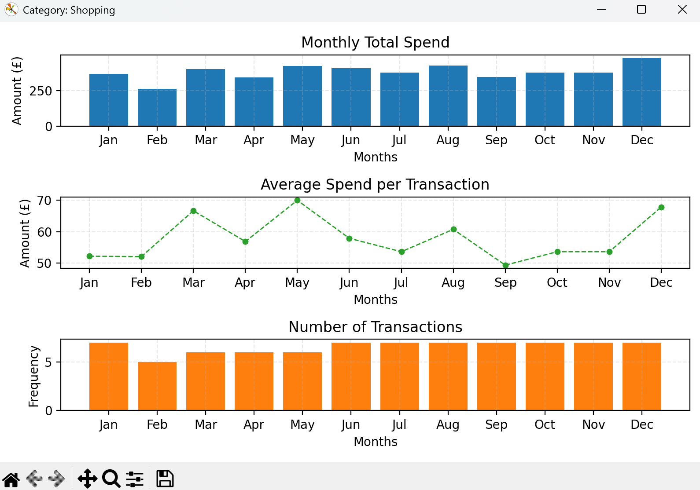
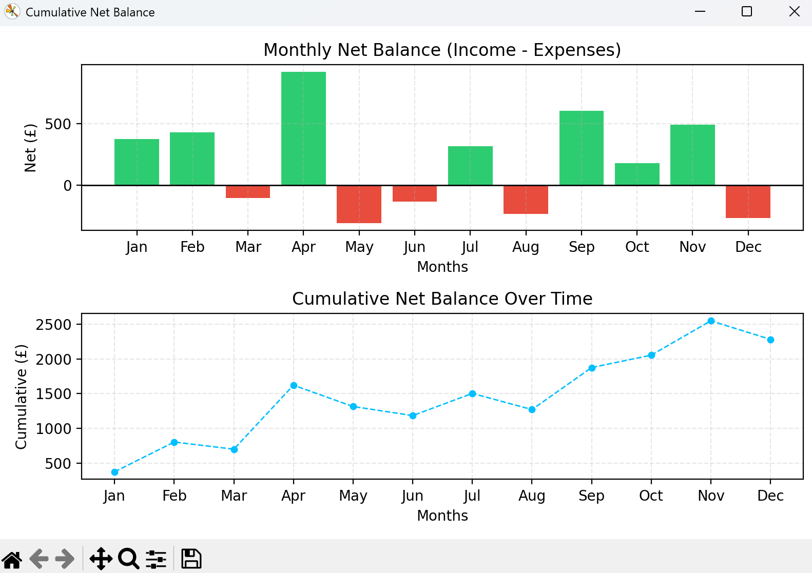
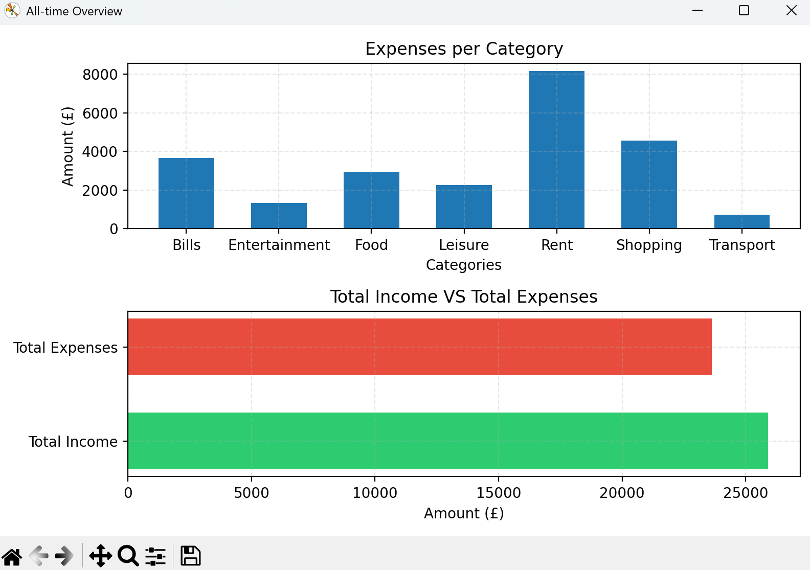

# Personal-Finance Tracker 💰

A Python-based command-line application for tracking income, expenses and visualising personal finances

---

## ✨ Features

- Add income, expenses, refunds with descriptions
- View transactions by **month** or **category**
- Calculate and display **cumulative net balance** across the year
- Generate an **all-time overview** of finances across the year
- Save and load transactions from `transactions.csv`
- Visualise finances with **bar charts, line charts and pie charts** using `matplotlib`

---

## 🛠️ Technologies Used

- **Python 3**
- **pandas** → data handling, CSV reading/writing, grouping, summarising
- **matplotlib** → financial visualisation 
- **Standard Library** → pathlib, numpy, datetime, sys, calendar

---

## 📖 What I Learned

- Core **OOP concepts** in Python (classes, instance/class variables, encapsulation)
- Organising code by refactoring procedural functions into methods
- **Data validation** with user input and exception handling
- Handling **CSV persistence** and edge cases (no file, empty data)
- Creating clear **docstrings** and **inline comments** for maintainability
- Generating professional **data visualisations**

---

## 📊 Example Visualisations

- View by Month Charts:

- View by Category Charts:

- View Cumulative Net Balance:

- View All-time Overview:

---

## 🔮 Future Improvements

- **Multi-year support** → Extend the system to handle transactions across multiple years, with filters for year selection alongside months and categories
- **Graphical User Interface (GUI)** → Add a simple, user-friendly interface to complement the command-line experience
- **Row-level transaction management** → Enable editing and deletion of individual transactions for greater flexibility

--- 

## 🧑‍💻 Author 

Developed by **Abdus-Samad Mohit**
- [LinkedIn](https://linkedin.com/in/samad-m)  
- [GitHub](https://github.com/Samad-M3)  

---